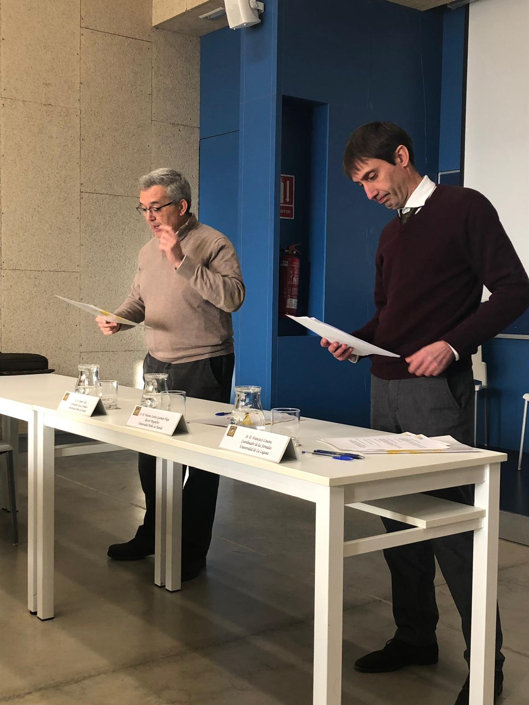
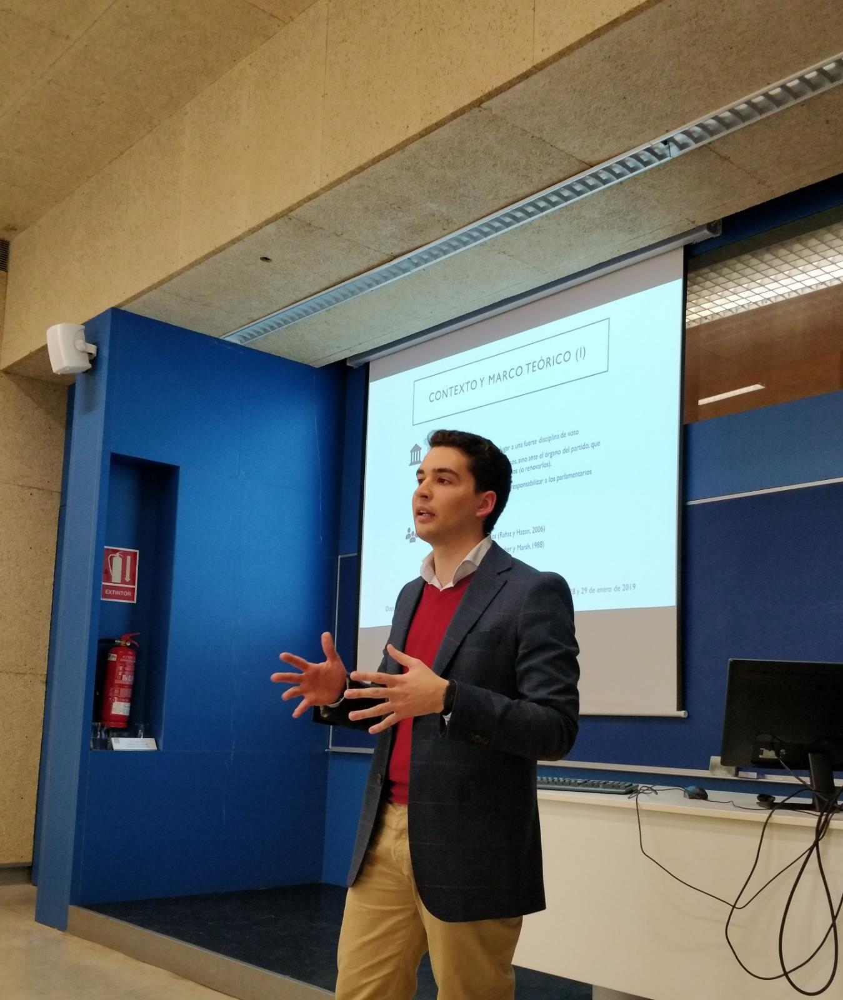

El pasado 28 de enero tuve el placer de participar en las I Jornadas de Experimentación: Sociología y Política organizadas conjuntamente por el Comité de Sociología Analítica de la Federación Española de Sociología y el Grupo de Investigación Democracia y Autonomías: Sociedad y Política en la Universidad Pablo de Olavide.

Desde aqui me gustaría extender mi agradecimiento a Xavier Coller y a Francisco Linares por darme la oportunidad de participar en las jornadas así como al resto de asistentes y compañeros por su valiosas aportaciones y comentarios.

  
