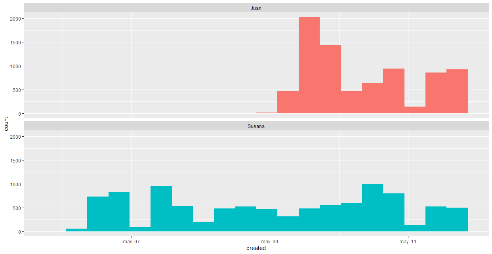
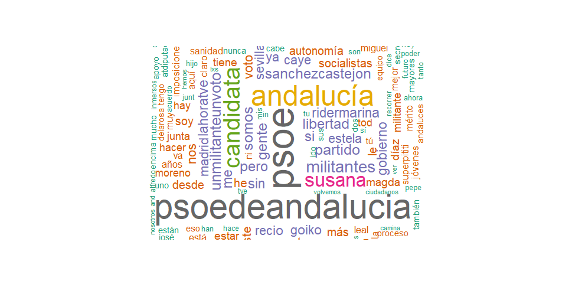
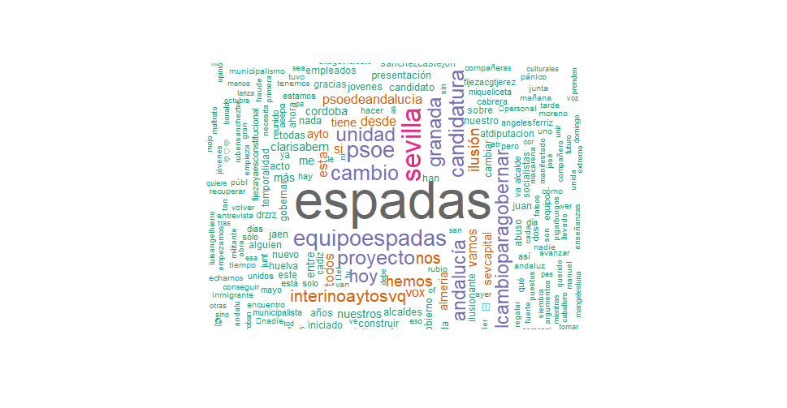
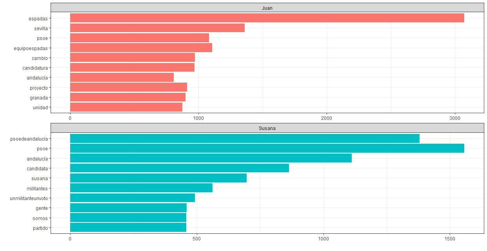
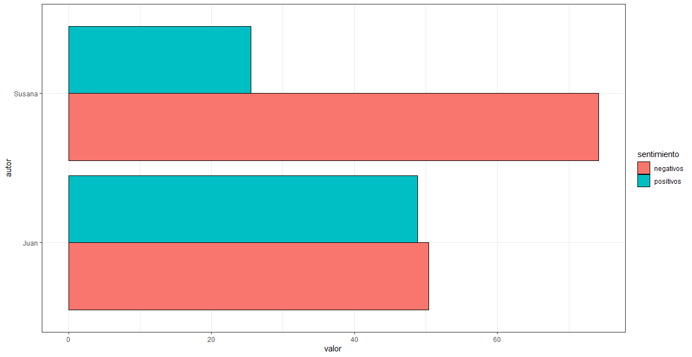

El pasado 6 de mayo, la Secretaria General del PSOE-A convocó el proceso de primarias para designar al candidato o candidata a la Junta de Andalucía para las próximas elecciones. Díaz apeló a la "libertad de los militantes" para pedir un proceso con garantías, donde la máxima es "un militante, un voto". En la misma rueda de prensa, Susana Díaz anunció su intención de concurrir a este proceso. Unos días más tarde, el 9 de mayo, Juan Espadas convocó un acto en Granada donde presentó su candidatura. Un primer análisis de las reacciones en Twitter a las cuentas de los candidatos nos dejan las siguientes imágenes.

**Gráfico 1. Número total de tuits mencionando a @SusanaDíaz y a @JuanEspadasSVQ por días (del 6 de mayo al 11 de mayo)**

El impacto que tiene el anuncio de Díaz es moderado en las redes sociales, aunque se mantiene estable en los primeros días de precampaña. Por su parte, la candidatura de Espadas irrumpe con más fuerza a partir del día 9, y pese a que el número de tuits baja en los días posteriores, sigue generando mayor impacto que la candidatura de la actual Secretaria General. El día 10 ambas cuentas generan un pico tras sendas entrevistas en TVE (Díaz) y en Canal Sur (Espadas).

Para analizar pormenorizadamente estos tuits en apoyo a los candidatos, nos fijamos en las palabras más utilizadas en los tuits de ambas candidaturas, construyendo las siguientes nubes de palabras para cada uno de ellos.

**Gráfico 2. Nube de palabras de tuits en apoyo a las candidaturas**

Como se puede observar, hay claras diferencias en las palabras que cada candidatura utiliza. Por ejemplo, en los tuits que apoyan a Susana Díaz, destacan: PSOE, PSOE de Andalucía, Andalucía, candidata, un militante un voto, militantes, partido... Por su parte, en la nube de palabras de Espadas, las palabras más utilizadas son: Espadas, Sevilla, Equipo Espadas, cambio, proyecto, unidad, candidatura, el cambio para gobernar... Estas diferencias se ven mejor en el siguiente gráfico, donde se hace un recuento total de cada una de las palabras más utilizadas en apoyo a cada candidatura.

**Gráfico 3. Recuento total de palabras más utilizadas en los tuits de apoyo a cada candidatura**

En la imagen anterior se hace un recuento total de las palabras más comunes en los tuits de apoyo a Díaz y a Espadas. Para este último, se menciona en mayor medida: Espadas, Sevilla, PSOE, Equipo Espadas, cambio, candidatura, Andalucía, proyecto, Granada y unidad. En el caso de los apoyos de Susana, las palabras más repetidas son: PSOE de Andalucía, PSOE, Andalucía, Candidata, Susana, Militantes, un militante un voto, gente, somos y partido.

Por último, se ha realizado un análisis de sentimientos a cada uno de los tuits analizados. Gracias a RStudio y a la librería "Bing", se identifican los sentimientos asociados a los tuits en positivos o negativos. Tras analizar 9603 tuits mencionando @SusanaDiaz y 7636 tuits que mencionan a @JuanEspadasSVQ, se ha obtenido el siguiente análisis.

**Gráfico 4. Análisis de sentimientos en los tuits de apoyo a Díaz y Espadas**

Los tuits que mencionan a Susana Díaz contienen mayor negatividad que aquellos que mencionan a Juan Espadas.  Este es un análisis primario y que solo contempla los primeros días de precampaña. De momento, parece que Espadas consigue (en redes sociales) una mayor movilización y una menor negatividad. Pero esto es solo en redes, en estos casos siempre conviene recordar que el mundo real es otro.

**BIBLIOGRAFÍA UTILIZADA**

Text mining con R: ejemplo práctico Twitter by Joaquín Amat Rodrigo, available under a Attribution 4.0 International (CC BY 4.0) at https://www.cienciadedatos.net/documentos/38_text_minig_con_r_ejemplo_practico_twitter.html